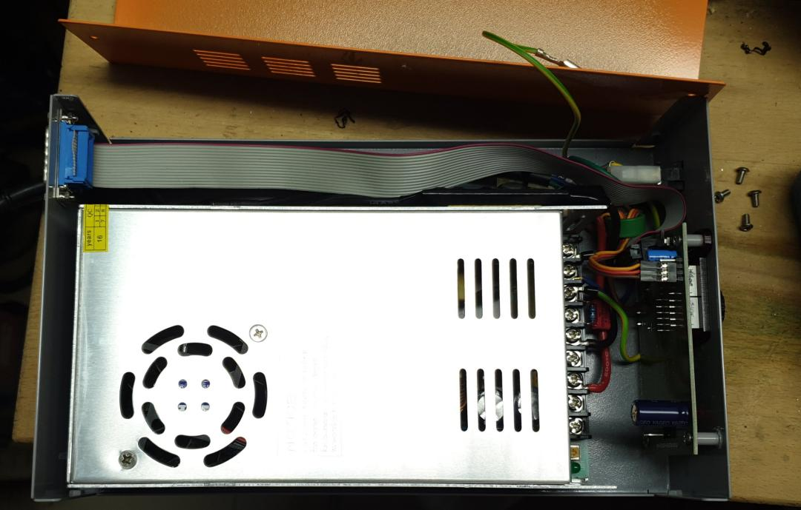
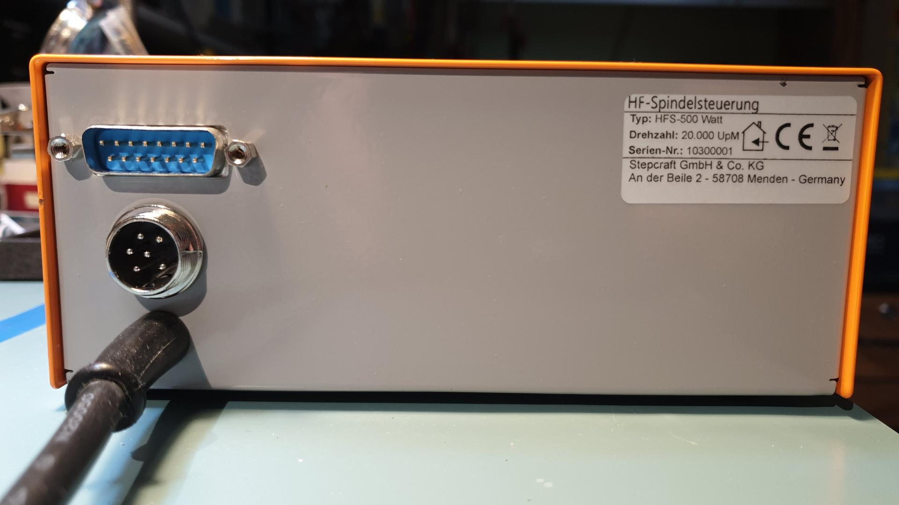
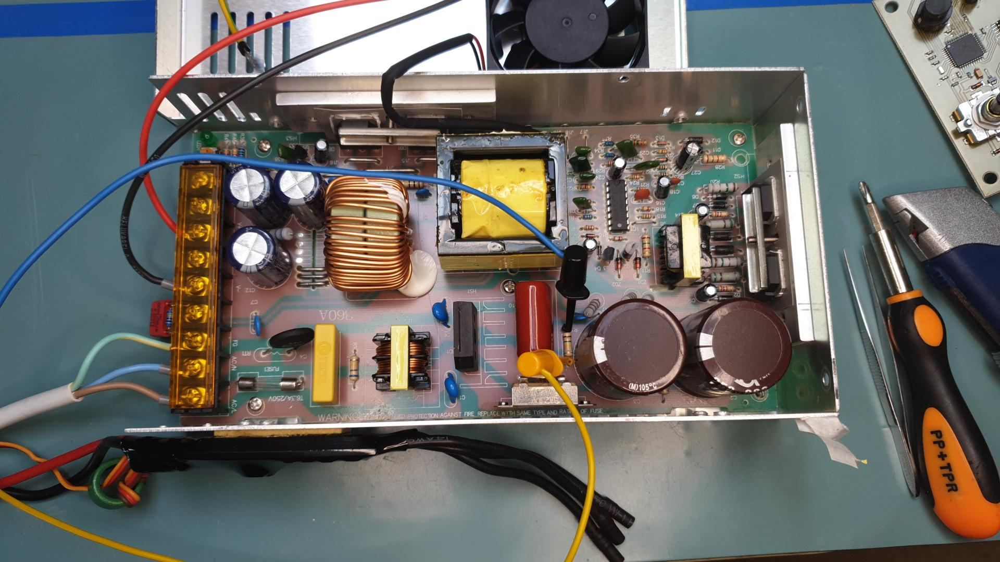
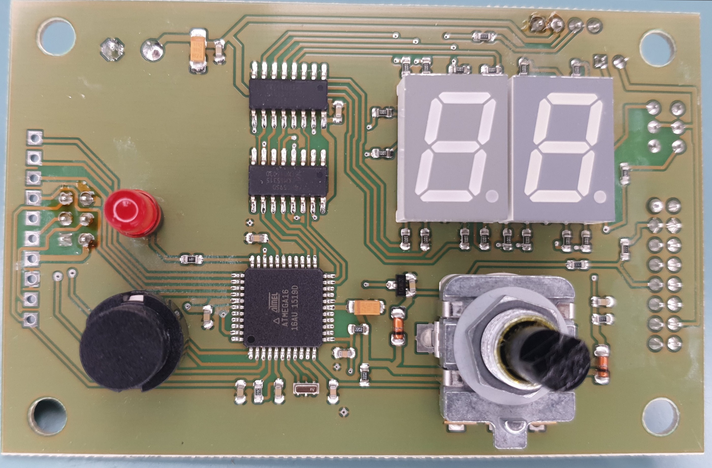
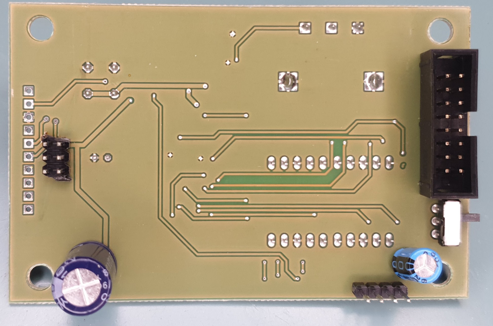

# HF500-controller
Reverse engineered schematic of Stepcraft HFS-500 spindle controller / VFD
front panel board.

The enclosure contains just a 24V 20A power supply ("S-500-24 MADE IN CHINA"),
the front panel PCB (more-or-less just a custom Arduino) and (presumably) an
off-the-shelf BLDC electronic speed controller (ESC) stuck to the PSU with
double sided tape.

If you need any more photos, feel free to open an issue. I took many more.

I did the reverse engineering mostly just to find out how the analog input for
RPM control was connected, but while I was at it, I reverse engineered the
front panel entire board.

I don't quite get why they connected that huge 220uF electrolytic cap straight
across the input with no series resistance. My stepcraft 600 controller board
outputs a PWM signal on pin 7 of the DA15 connector. It is only when the
HF-500 is connected that the signal turns into 0-5V analog - and a noisy one
at that. I suspect the CNC controller does not have a resistor on the PWM
output, so they are driving the cap directly with a TTL chip's output stage.
Not good at all.

Other than that, the board is simple enough. Two 7-segment displays connected
through two SIPO shift registers acting as pin expanders, a digital input for
the spindle enable signal, a rotary encode, a button and an LED. Everything is
controlled by an ATmega16 MCU. I even dumped the firmware with a usbasp (see
`firmware/`, but unfortunately I cannot publish the actual image).

The whole board seems rather amateur-ish. It seems like they didn't even run a
DRC check before sending the board to production. If you look close enough,
you can find a few traces that aren't connected to anything.

## Duty cycle measurement
I wanted to know why the device cannot spin the motor down to really slow
RPMs, so I measured the duty cycle of `ESC_PWM` (at J2 pin3 with the ESC
diconnected) as a function of the number shown on the from panel display.

Measured with FY6900.

PWM frequency: 45.4 Hz

| display | duty  | +Width    | -Width      |
|--------:|------:|----------:|------------:|
|       0 | 4.9 % | 1.0711 ms | 20.955 ms   |
|       5 | 4.9 % | 1.0711 ms | 20.955 ms   |
|       8 | 4.9 % | 1.0711 ms | 20.955 ms   |
|       9 | 4.9 % | 1.0711 ms | 20.955 ms   |
|      10 | 5.3 % | 1.1619 ms | 20.864 ms   |
|      11 | 5.3 % | 1.1716 ms | 20.854 ms   |
|      12 | 5.4 % | 1.1789 ms | 20.847 ms   |
|      13 | 5.4 % | 1.1840 ms | 20.842 ms   |
|      14 | 5.4 % | 1.1905 ms | 20.835 ms   |
|      15 | 5.5 % | 1.2076 ms | 20.818 ms   |
|      20 | 5.7 % | 1.2555 ms | 20.770 ms   |
|      25 | 5.8 % | 1.2738 ms | 20.752 ms   |
|      30 | 6.0 % | 1.3194 ms | 20.706 ms   |
|      35 | 6.2 % | 1.3708 ms | 20.655 ms   |
|      40 | 6.4 % | 1.4129 ms | 20.610 ms   |
|      45 | 6.6 % | 1.4581 ms | 20.568 ms   |
|      50 | 6.8 % | 1.5021 ms | 20.524 ms   |
|      60 | 7.2 % | 1.5789 ms | 20.447 ms   |
|      70 | 7.6 % | 1.6732 ms | 20.353 ms   |
|      80 | 8.0 % | 1.7563 ms | 20.270 ms   |
|      85 | 8.2 % | 1.7969 ms | 20.229 ms   |
|      90 | 8.3 % | 1.8340 ms | 20.192 ms   |
|      91 | 8.4 % | 1.8403 ms | 20.186 ms   |
|      92 | 8.4 % | 1.8453 ms | 20.181 ms   |
|      93 | 8.4 % | 1.8496 ms | 20.176 ms   |
|      94 | 8.4 % | 1.8573 ms | 20.169 ms   |
|      95 | 8.5 % | 1.8736 ms | 20.152 ms   |
|      96 | 8.6 % | 1.8952 ms | 20.131 ms   |
|      97 | 8.7 % | 1.9094 ms | 20.116 ms   |
|      98 | 8.7 % | 1.9174 ms | 20.109 ms   |
|      99 | 8.7 % | 1.9241 ms | 20.102 ms   |

So yeah, the ATmega does not tell the ESC to start spinning the motor until
the number 10 is shown on the display, at which point there is a sudden jump
in duty cycle.

Pressing the button to turn the spindle off has the exact same effect as
setting 0 on the display.
