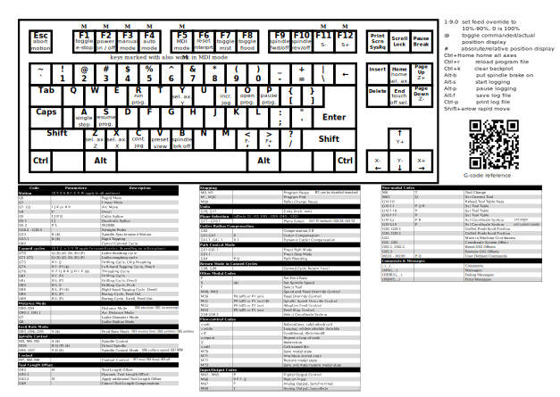

# LinuxCNC notes & config
- probe screen: https://github.com/verser-git/probe_screen_v2.9
  - I'm running a lightly modified version to work around manual tool changing
    issues, but I haven't gotten around to publishing it yet.

### Keyboard shortcut cheatsheet
- based off https://commons.wikimedia.org/wiki/File:QWERTY_keyboard_diagram.svg
- http://wiki.linuxcnc.org/cgi-bin/wiki.pl?Keyboard_Shortcuts

